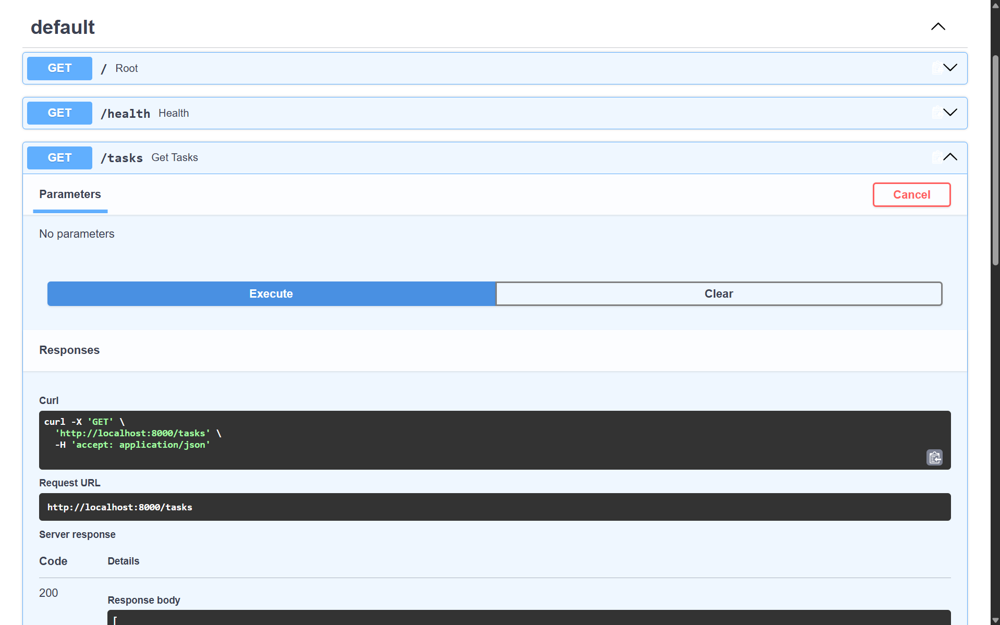

# Task API

A simple CRUD API for managing a to-do list, built with FastAPI. Tasks are stored in memory (no database) — data resets when the server restarts.

## How to run

```bash
python -m venv venv
venv\Scripts\activate      # Windows
pip install fastapi uvicorn
uvicorn main:app --reload --port 8000
```

Then visit `http://localhost:8000/docs` for the interactive Swagger UI.

## Endpoints

| Method | Path             | Description                  |
|--------|------------------|-------------------------------|
| GET    | /                | API info                      |
| GET    | /health          | Health check                  |
| GET    | /tasks           | List all tasks                |
| GET    | /tasks/{id}      | Get a single task             |
| POST   | /tasks           | Create a new task             |
| PUT    | /tasks/{id}      | Update a task                 |
| DELETE | /tasks/{id}      | Delete a task                 |

## Example request

```bash
curl -i http://localhost:8000/tasks
```
```
HTTP/1.1 200 OK
date: Sun, 23 Aug 2026 02:02:43 GMT
server: uvicorn
content-length: 144
content-type: application/json

[{"id":1,"title":"Learn FastAPI","done":false},{"id":2,"title":"Build CRUD API","done":false},{"id":3,"title":"Test with Swagger","done":false}]
```


## Swagger UI

